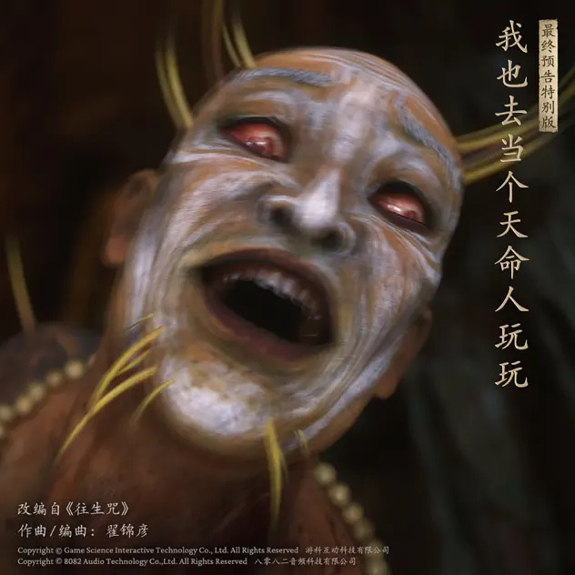
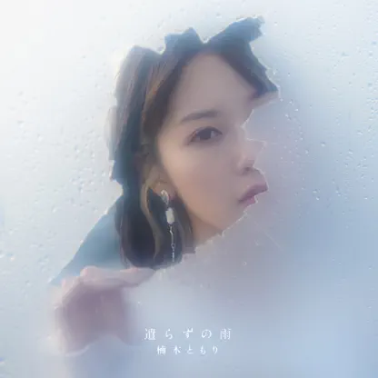
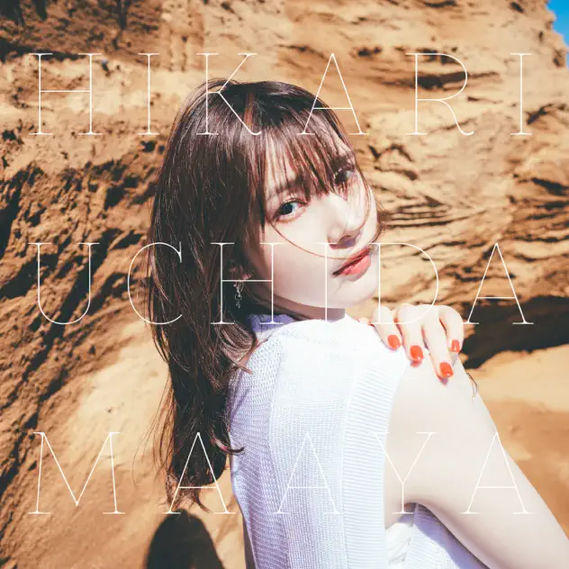
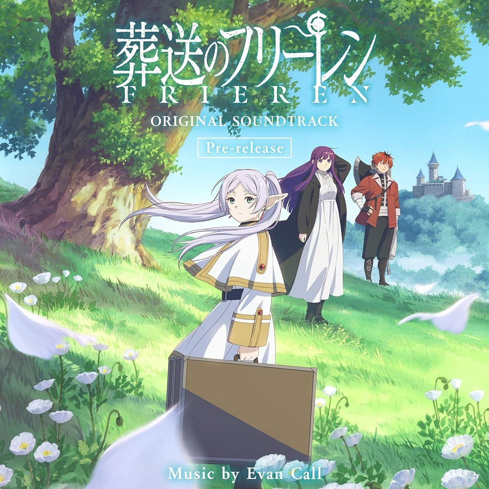

又到了一年的结束，我现在才发现好像2023年我的年终总结写了一半还没写完，这都2024了。

为了避免这种事情，我决定一部分一部分写，这样内容少一点，会更快完成，于是就有了这篇音乐的总结。

## The Music Award

想挑一首我自己的2024年年度最佳歌曲，结果发现自己听的多的都是去年或者更老的曲子。想来想去今年出的曲子里给我印象比较深刻的，可能是鲤鱼姐的「倔强游戏」了。

鲤鱼姐最开始以日语歌出道，后面出的日语曲子也只是有些会用中文重新填词，「倔强游戏」没记错应该是第一首纯中文的单曲，给我的感觉比以前重新用中文填词的曲子优秀太多。在年底之前又出了新的中文EP，希望鲤鱼姐的中文歌做得越来越好。

除了鲤鱼姐以外，今年更给我留下印象的曲子还有一首是黑神话ost里的「我也去当个天命人玩玩」，对，就是那个最终预告里的大雷音寺电音。只是可惜游戏里这个曲子用在了一个毫无存在感的boss身上，打完之后我都没意识到放了这首歌。

## 最佳歌手

从Apple Music开始做年度总结开始，我的年度歌手就一直是鬼头明里，连续三年都是这样。曾经有一段时间回家一直都是听着鬼头姐的歌单踩单车的，一晃三年就过去了，时间过的真是快。今年鬼头姐的新专辑做的也很不错，比方说「Rock the Floor」和「青のーコマ」。但另一方面，果然「23時の春雷少女」还是好听啊。

今年还听了不少楠木灯和内田真扎的歌。楠木灯自己写的歌那种哀伤的感觉相当触动我，以至于她给一些动画写的op ed主要为了契合动画内容，反而不怎么有印象。

「alive」这首歌感觉特别适合做那种很文青的VLOG配乐，比方说搞点精致料理之类的。

内田姐的歌就给我的感觉是非常契合她的人设。虽然内田姐现在作为IM头牌，戏路还是相当宽广的。但是歌曲还是相当贴合平日里很多活动或者节目里的形象。即使歌词没有刚出道时候那么中二病了，风格却相对统一。「アストラ」是我比较喜欢的一首歌，里面的歌词「世界は存外美して」挺触动我的。当时正好在学日语，研究了很久这歌词啥意思。

## 专辑

我今年的年度动画必然是「葬送のフリーレン」，虽然这并非是今年开始更新的动画，但我已经看了四五遍了。

以前我可能总结过，「日常生活中的奇幻」就是我最喜欢的番的类别。比方说「日常系的异能战斗」。但所谓「日常」则并非要贴近我自己的日常（废话，人要贴近也是贴近日本人的日常），而是传达出一种日常的氛围，然后在这其中，去穿插一些怪力乱神却又逻辑自洽的逻辑。

如果说浮力莲的动画很好的把握了这个火候，那么埃文考尔给浮力莲制作的配乐则是这道料理里最亮眼的调味。不管是「Zoltraak」所营造的史诗战斗氛围，还是「Grassy Turtles and Seed Rats」传递的闲适和悠然，音符的流转之中，一副中世纪羊皮古卷缓缓打开。我们没有浮力莲那样长到几乎永恒的寿命，但我们却拥有和她一样的疑惑，并且也必然要踏上解答自己疑惑的旅程。既如此，我愿与这些音乐相伴到终点。

## 碎碎念

今年的听歌时间确实是比去年下降了（少了差不多1w分钟），可能是因为我日常携带的耳机坏了，而我又一直拖延到年底才重新买。希望明年能多听点歌吧。本年度我最治愈的一个周末就是，一边打纪元1800一边听歌，实在是太爽了。

今年的红白晚会看上去没有前几年那么「新」，但是已经有不少想看的东西。比方说B'z的首次登台，比方说米津玄师，比方说许久不曾登台的柯南剧场版——尽管我觉得黑铁更加好看，却不妨碍人家歌好听啊。
